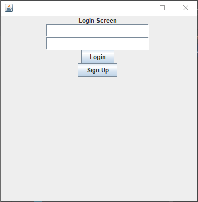
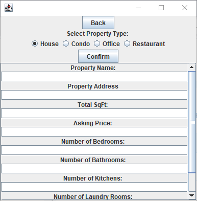
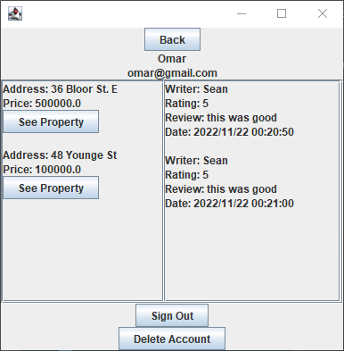
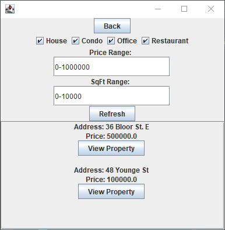
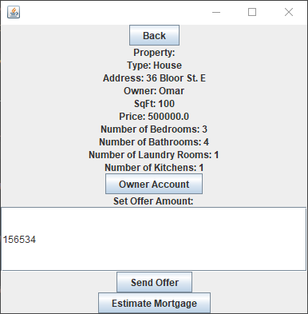
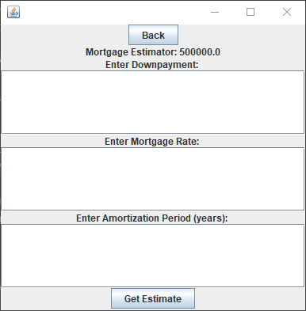

# Real Estate App

Our program provides a platform for owners, buyers, and real estate agents to connect with each other by sharing and viewing properties. 

## Features at a Glance

* [User login system](#1-creating-a-user-account-and-logging-in)
* [Listing properties](#2-listing-a-property)
* [Viewing User Account](#3-viewing-user-account)
* [Viewing and filtering properties](#4-filtering-and-viewing-properties)
* [Bidding on properties](#5-bidding-on-a-property)
* [Estimating Mortgage](#6-estimating-mortgage)
* [User messaging system](#7-messaging-users)
* [Hiring Realtors](#8-hiring-realtors)

## Running the Program

This project requires [Java 17](https://www.oracle.com/java/technologies/javase/jdk17-archive-downloads.html)

Clone the repository with 
```sh
git clone https://github.com/CSC207-2022F-UofT/course-project-group-103.git
cd course-project-group-103
```

As a standard gradle project, it can be run with 

```sh
./gradlew run
``` 
in your IDE terminal

### 1. Creating a User Account and Logging In

When the program first starts, users are met with the login screen, where they can choose to create an account with their desired credentials or login to an exising user account.



Pressing Sign Up takes users to a separate screen where they are prompted to enter a name, email, and password for a new account.
### 2. Listing a Property
After account creation and logging in, users can choose to list a property



All the fields must be filled to add the listing to the property database


### 3. Viewing User Account
A user's own account can be viewed from the main page, where information about their properties and received reviews can be accessed.



### 4. Filtering and Viewing Properties
To view listings, users can view all properties available through the View Listings button on the home screen.



Alternatively, users can filter by price and square footage to narrow down on a specific attribute.

### 5. Bidding on a Property
Users can bid on a property directly on the property page.



### 6. Estimating Mortgage
There is a mortgage calculator provided given a fixed mortgage rate.



### 7. Messaging Users
Users can message each other freely on the basis of buying and selling properties.

### 8. Hiring Realtors
Users can locate realtors via a realtor listings page, and hire them through our app. Realtor contact information is also provided for possible clients. 

## Contributors (alphabetical)
Group 103: Real estate listing app + Shakeeb
Omar Al Jaljuli, Rakan Alhamoury, Juliet Li, Sean Malla, Shakeeb Monzer, Eric Shi, Zein Sulayman, Kyle Vavasour